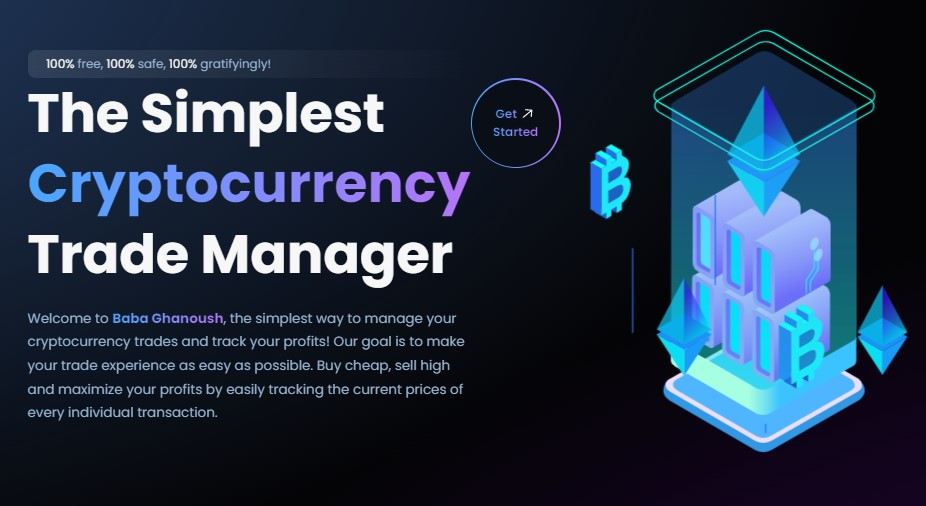
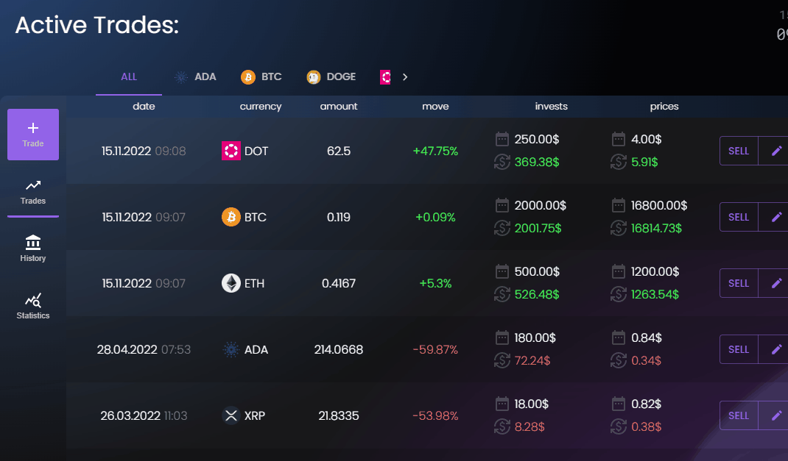

****

 

<h3 align="center">Baba Ghanoush</h3>

The Simplest Cryptocurrency Trade Manger
 
    <a href="http://test.n5sjg7aubr.smallhost.pl/">View Demo</a>
  

## About The Project

`Baba Ghanoush` is a cryptocurrency trade manager. The application allows tracking user’s cryptocurrency investments and its history. The user manually adds his current purchases to the application. The application stores the details of the purchase and informs him about the profit or loss, depending on the market situation.
___
### Built With

___
### Front-End:
* Repository: [here](https://github.com/sextus-empiricus/bbg-fe)
___
### See more:

 
